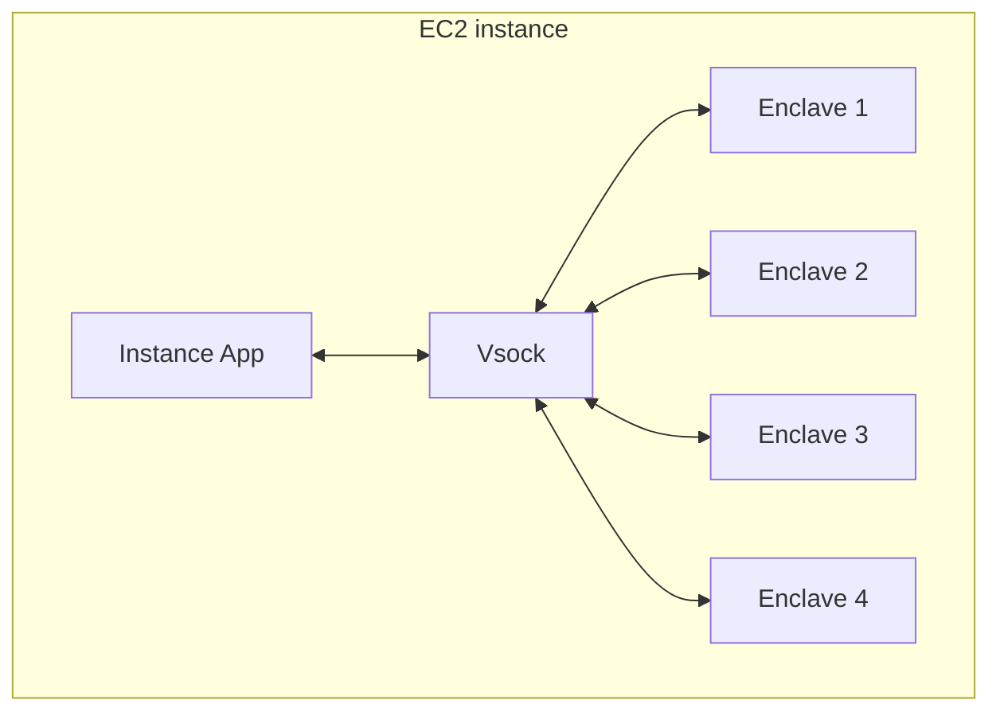
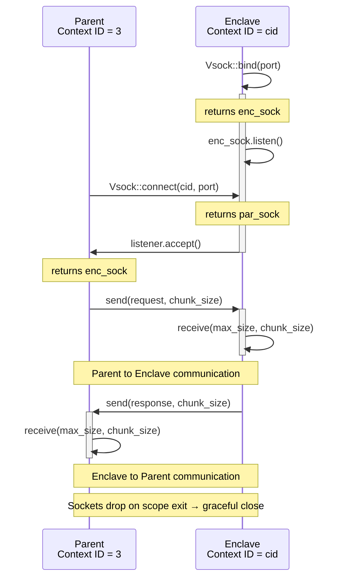

# Tiny Vsock

[](https://crates.io/crates/tiny-vsock)
[](https://orlowskilp.github.io/tiny-vsock/tiny_vsock/)
[](https://codecov.io/github/orlowskilp/tiny-vsock)
[](/LICENSE)

A lean, dependency-light Rust library for `AF_VSOCK` communication — the socket family
designed for secure, high-performance communication between a host and its virtual machines
or confidential computing enclaves (designed with the latter in mind).

If you're building for **AWS Nitro Enclaves**, **KVM guests**, or any other hypervisor
environment where you need a reliable channel between the host and a VM, `tiny-vsock` gets
you there with minimal ceremony.

---

## What is vsock

`AF_VSOCK` is a reliable, bidirectional, connection-oriented socket family for communication between a host and its virtual machines.
Unlike standard `AF_INET` sockets, vsocks operate at the hypervisor level and do not require IP addresses or network interfaces.

In AWS Nitro Enclaves, the typical topology is a hub-and-spoke model: one application on the EC2 parent instance communicates with up
to 4 Nitro Enclaves, each over its own vsock pair.

Nitro Enclaves are completely isolated from the parent. They have no network connectivity, use ephemeral storage, and run in a separate
address space. The vsock is the only communication path between parent and enclave.



## How vsock works

One of common patterns is a service that runs in an enclave and parent works like a client.
The enclave binds and listens on a port, the parent connects, and data flows bidirectionally via chunked
`send`/`receive` calls. Because the vsock operates over a `SOCK_STREAM` socket, `send` is guaranteed to succeed
if the call returns, though `receive` may return `EAGAIN` on a non-blocking socket.



**Key points:**

- The enclave service binds to a specific port and listens on any CID `3`, which the Nitro hypervisor maps to the parent.
- The parent connects to any CID `u32::MAX` (`ANY_CID_ADDR`).
- The `Vsock::connect` call retries with exponential backoff because enclaves may take time to start.
- `receive(max_size, chunk_size)` enforces a hard cap on incoming data to prevent allocation-based DoS.

---

## Why `tiny-vsock`?

Most vsock wrappers drag in heavy async runtimes or sprawling socket abstractions you'll
never use. `tiny-vsock` does one thing: gives you a clean, safe Rust API over the raw
vsock primitives — connect, bind, listen, accept, send, receive — and stays out of your
way.

- **Minimal dependencies** — `anyhow`, `nix`, `tracing`. That's it.
- **Automatic retry with exponential backoff** on connect, because enclaves don't always
  start instantaneously.
- **Built-in buffer cap on receive** to prevent runaway allocations from misbehaving
  peers.
- **Optional `std::io` compatibility** via the `std-io` feature flag.

---

## Installation

Add the following to your `Cargo.toml`:

```toml
[dependencies]
tiny-vsock = "0.1.2"
```

To enable `std::io::Read` / `std::io::Write` trait implementations:

```toml
[dependencies]
tiny-vsock = { version = "0.1.2", features = ["std-io"] }
```

---

## Quick start

### Server side

```rust
use tiny_vsock::Vsock;

let listener = Vsock::bind(5000)?;
listener.listen()?;

let conn = listener.accept()?;
let data = conn.receive(8192, 1024)?;
println!("Received: {:?}", data);
```

### Client side

```rust
use tiny_vsock::Vsock;

// Vsock::PARENT_NE_CID_ADDR (3) for Nitro Enclave parent, or supply your own CID
let conn = Vsock::connect(Vsock::PARENT_NE_CID_ADDR, 5000)?;
conn.send(b"Hello from the enclave!", 1024)?;
```

---

## Examples

The repository ships three runnable examples in `examples/`.

### `enclave-echo-service` and `parent-echo-client`

A complete Nitro Enclave echo pair. Run the service inside the enclave and the
client on the parent instance:

```sh
cargo run --example enclave-echo-service
cargo run --example parent-echo-client
```

Both examples use compile-time constants (`PORT`, `CID`, `MAX_DATA_SIZE`,
`CHUNK_SIZE`) defined at the top of each file — edit them to match your
environment before running.

### `std_io_echo`

Demonstrates the `std-io` feature. Requires `--features std-io`:

```sh
cargo run --example std_io_echo --features std-io -- server
cargo run --example std_io_echo --features std-io -- client
```

---

## API overview

| Method                                           | Description                                                                   |
| ------------------------------------------------ | ----------------------------------------------------------------------------- |
| `Vsock::bind(port)`                              | Bind to the given port, accepting connections from any CID                    |
| `Vsock::listen()`                                | Mark the socket as passive (ready to accept)                                  |
| `Vsock::accept()`                                | Block until a client connects; returns a new `Vsock` for that connection      |
| `Vsock::connect(cid, port)`                      | Connect to a remote CID/port, retrying up to 5 times with exponential backoff |
| `Vsock::connect_with_max_attempts(cid, port, n)` | Same as above with a configurable retry limit                                 |
| `Vsock::send(data, chunk_size)`                  | Send a byte slice in chunks; handles `EINTR` transparently                    |
| `Vsock::receive(max_size, chunk_size)`           | Receive bytes up to `max_size`; returns an error if the peer sends more       |

### Useful constants

| Constant                    | Value      | Purpose                                            |
| --------------------------- | ---------- | -------------------------------------------------- |
| `Vsock::ANY_CID_ADDR`       | `u32::MAX` | Bind address that accepts connections from any CID |
| `Vsock::PARENT_NE_CID_ADDR` | `3`        | CID of the parent instance in AWS Nitro Enclaves   |

---

## Features

### `std-io`

Enables `std::io::Read` and `std::io::Write` implementations on `Vsock`, letting you
pass it directly to anything that accepts those traits (e.g. `BufReader`, `serde`
deserializers, `read_to_end`).

```rust
use std::io::{Read as _, Write as _};
use tiny_vsock::Vsock;

let mut conn = Vsock::connect(3, 5000)?;
conn.write_all(b"payload")?;
conn.flush()?; // shuts down the write side, signalling EOF to the peer

let mut buf = vec![];
conn.read_to_end(&mut buf)?;
```

> **Prefer `send`/`receive` for performance-sensitive paths.** They support explicit
> chunking and enforce a hard cap on incoming data size, which protects against
> allocation-based DoS from a misbehaving peer.

## Test coverage

The coverage measured with GitHub runners is limited to what can be executed without external runners. I encourage you to run coverage
measurement locally, with:

```shell
cargo llvm-cov --all-features
```

| Filename   | Regs | ❌ Regs | Cover  | Fn | ❌ Fn | Executed | 〰️  | ❌ 〰️ | Cover  | 🕊️ | ❌ 🕊️ |
| ---------- | ---- | ------- | ------ | -- | ----- | -------- | --- | ----- | ------ | - | ---- |
| src/lib.rs | 474  | 26      | 94.51% | 52 | 1     | 98.08%   | 284 | 22    | 92.25% | 0 | 0    |
| TOTAL      | 474  | 26      | 94.51% | 52 | 1     | 98.08%   | 284 | 22    | 92.25% | 0 | 0    |

---

Copyright (c) 2026 Lukasz Orlowski <lukasz@orlowski.io>. All rights granted under MIT license.
